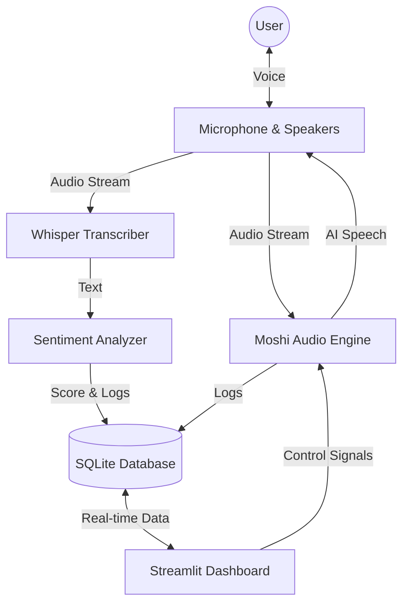

# 🎙️ VoxIntel Engine
### **Real-time Empathetic Voice AI Platform**

[](https://www.python.org/)
[](https://streamlit.io/)
[](https://github.com/kyutai-labs/moshi)
[](https://github.com/openai/whisper)
[](./LICENSE)

**VoxIntel Engine** is a cutting-edge, **on-device** conversational AI system that combines full-duplex voice interaction with real-time sentiment analysis. It features a futuristic **Liquid Glass UI** that visually reacts to the user's emotions and voice, creating an immersive "AI Entity" experience.

---

## 🌟 Key Features

### 🧠 Core Intelligence
- **Full-Duplex Conversation:** Powered by **Moshi (Kyutai)**, enabling seamless, interruptible voice conversations with ultra-low latency.
- **Local Speech Recognition:** Uses **OpenAI Whisper (Base.en)** running locally for privacy-first, accurate user transcription.
- **Sentiment Analysis Engine:** Analyzes user speech in real-time using **VADER** to determine emotional state (Positive, Neutral, Negative).
- **Echo Cancellation:** Advanced text-based filtering to prevent the AI from hearing its own voice.

### 🎨 Visual Experience
- **Interactive AI Avatar:** A 2D minimalist robot face that blinks, looks at your mouse cursor, and animates its mouth based on voice activity.
- **Mood-Adaptive UI:** The entire interface (colors, glow, robot expression) changes dynamically based on the user's sentiment score.
- **Liquid Glass Design:** A modern, frosted-glass aesthetic with a deep space animated particle background.
- **Control Center:** Start/Stop the entire AI engine directly from the web interface.

---

## 🛠️ Architecture

The system is built on a modular Python architecture:



---

## 🚀 Installation

### Prerequisites
- **macOS (Apple Silicon M1/M2/M3/M4 recommended)** for optimal performance with MLX.
- Python 3.10 or higher.
- `ffmpeg` installed (`brew install ffmpeg`).

### Setup

1.  **Clone the repository:**
    ```bash
    git clone https://github.com/yourusername/VoxIntel-Engine.git
    cd VoxIntel-Engine
    ```

2.  **Create a virtual environment:**
    ```bash
    python -m venv venv
    source venv/bin/activate
    ```

3.  **Install dependencies:**
    ```bash
    pip install -r requirements.txt
    ```
    *(Note: `moshi_mlx`, `mlx`, and `rustymimi` may require platform-specific setup on Apple Silicon.)*

---

## 🎮 Usage

1.  **Launch the Dashboard:**
    ```bash
    python main.py dashboard
    ```

2.  **Start the Experience:**
    - Open your browser at `http://localhost:8501`.
    - Click the **"✨ START ENGINE"** button.
    - Wait for the status to turn **ONLINE**.

3.  **Interact:**
    - Speak to the AI.
    - Watch the robot face react to your voice and mood.
    - The background particles will glow brighter as the conversation intensifies!

4.  **Optional direct engine run:**
    ```bash
    python main.py engine
    ```

---

## 📂 Project Structure

```
VoxIntel-Engine/
├── src/
│   ├── analysis/          # Sentiment analysis logic (VADER)
│   ├── core/              # Core AI Engines
│   │   ├── audio_engine.py    # Main orchestrator
│   │   ├── moshi_app.py       # Custom Moshi wrapper
│   │   └── user_transcriber.py # Whisper transcription worker
│   ├── dashboard/         # Streamlit UI & Visuals
│   │   └── app.py
│   └── database/          # SQLite manager
├── tests/                 # Simulation scripts
└── requirements.txt       # Dependencies
```

---

## 🔮 Future Roadmap

- [ ] **Voice Cloning:** Add capability to clone specific voices for the AI.
- [ ] **LLM Integration:** Connect to local LLMs (Llama 3) for more complex reasoning.
- [ ] **Vision:** Add camera support for facial emotion recognition.
- [ ] **Docker Support:** Containerize for easy deployment.

---

## 🤝 Contributing

Contributions are welcome! Please feel free to submit a Pull Request.

## 📄 License

This project is licensed under the MIT License - see the [LICENSE](LICENSE) file for details.
